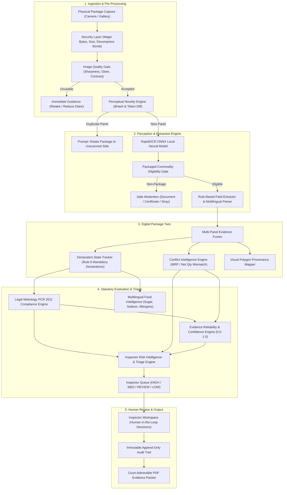

# LABEL LENS AI — FINAL ARCHITECTURE SPECIFICATION
**Complete Subsystem Reference, Pipeline Flow & Design Invariants (Phases 1–14)**  
**Document Version**: `1.0.0-final` | **SIH Problem Statement**: SIH26034

---

## 1. End-to-End System Architecture

---

## 2. Core Architectural Invariants

### Invariant 1: Strict Separation of Concerns
Under NO circumstances are the following three values confused or merged into a single metric:
1. **Evidence Confidence (Reliability)**: Quantifies the optical and perceptual certainty of the captured evidence (0.0 to 1.0). High confidence does NOT imply legal compliance.
2. **Statutory Compliance**: Evaluates package declarations against the Legal Metrology (Packaged Commodities) Rules 2011. A package with 100% confidence may still be non-compliant.
3. **Inspection Priority**: Evaluates the urgency of human inspection based on consumer harm severity, fraud indicators, and evidentiary ambiguity.

### Invariant 2: Active vs Finalized State Tracking
During multi-panel scanning, missing statutory fields are classified as `NOT_YET_OBSERVED`. The system NEVER prematurely marks a package non-compliant while the operator is still photographing panels. Only upon explicit finalization does an unobserved declaration transition to `POSSIBLY_MISSING`.

### Invariant 3: Zero Simulated Verification & Zero Hallucination
- External registry lookups (e.g. FSSAI or GS1) that cannot be completed return `SOURCE UNAVAILABLE`.
- The system never manufactures fake registration numbers, hypothetical compliance approvals, or synthetic confidence scores.
- Non-package imagery (certificates, invoices, random objects) is decisively abstained via `INSUFFICIENT_PACKAGE_LABEL_EVIDENCE`.

---

## 3. Subsystem Breakdown

### 1. Optical Character Recognition (`app.services.ocr_service`)
- **Engine**: RapidOCR ONNX runtime running locally on CPU.
- **Preprocessing**: Luminance CLAHE contrast enhancement and bilateral noise filtration.
- **Multi-Script Support**: Latin (English) and Devanagari (Hindi) with transliteration fallback.

### 2. Multi-Panel Digital Package Twin (`app.services.digital_twin_service`)
- **Deduplication**: 64-bit perceptual difference hash (`dHash`) with a Hamming distance threshold of $\le 5$.
- **Field Fusion**: Multi-panel aggregation assigning field-level confidence, bounding polygons, and source panel indices.
- **Conflict Flagging**: Identifies discrepancy between panels (e.g. Panel 1 declares ₹20, Panel 2 declares ₹25).

### 3. Legal Metrology Compliance Engine (`app.services.rules_engine`)
Evaluates mandatory requirements under the Legal Metrology (Packaged Commodities) Rules 2011:
- **Rule 6(1)(a)**: Name and address of the manufacturer/packer/importer.
- **Rule 6(1)(b)**: Common or generic name of the commodity.
- **Rule 6(1)(c)**: Net quantity in standard units (g, kg, ml, l).
- **Rule 6(1)(d)**: Month and year of manufacture/packing/import.
- **Rule 6(1)(da)**: Maximum Retail Price (MRP) inclusive of all taxes.
- **Rule 6(1)(e)**: Consumer care details (phone, email, postal address).
- **Rule 7 & 8**: Principal Display Panel dimensions and minimum font height requirements.

### 4. Inspector Risk Triage Engine (`app.services.risk_engine`)
Assigns inspection cases into 4 priority queues:
- `HIGH_PRIORITY`: Severe statutory violations (missing net quantity, missing MRP, deliberate price tampering).
- `MEDIUM_PRIORITY`: Minor or non-critical omissions (missing consumer care email, partial address).
- `REVIEW_PRIORITY`: Conflicting panel evidence or low optical confidence requiring human visual verification.
- `LOW_PRIORITY`: Fully verified statutory compliance with high evidence reliability.
